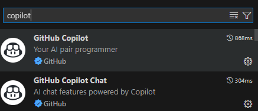
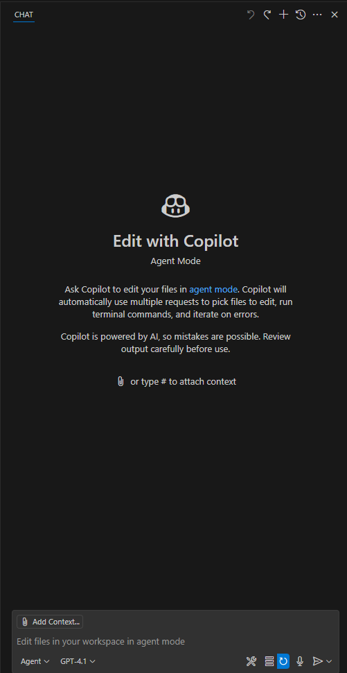
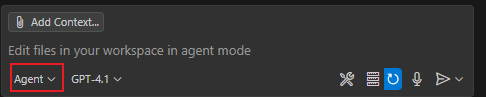
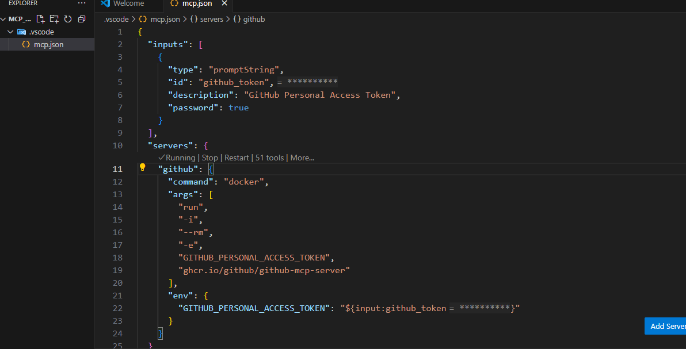
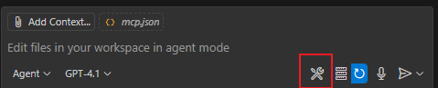
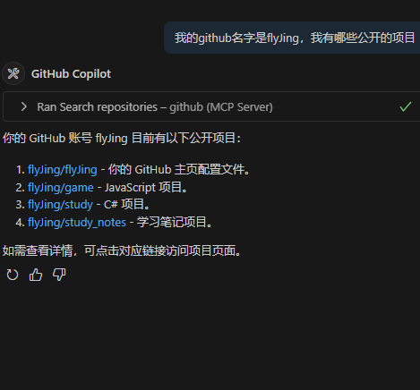
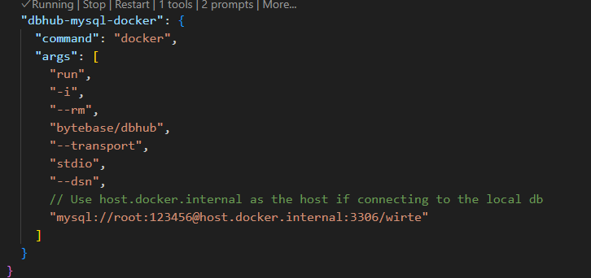
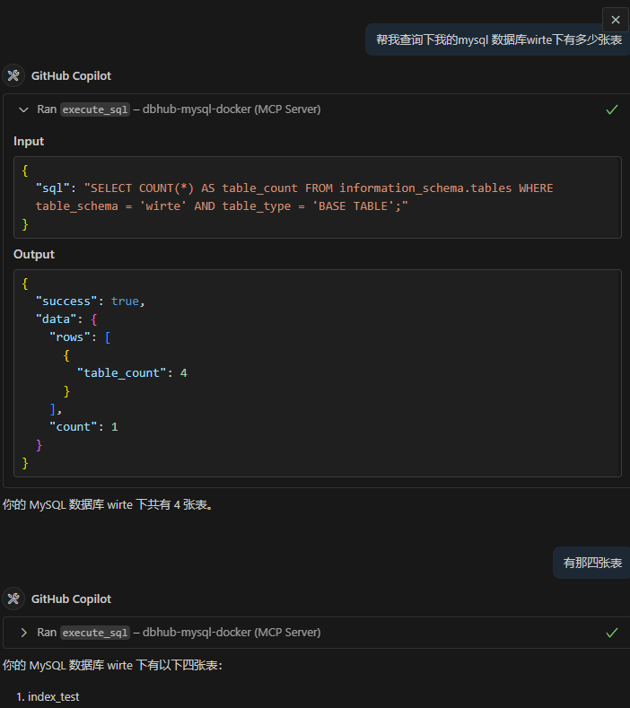

github 地址：https://github.com/github/github-mcp-server?tab=readme-ov-file

前提：需要安装 docker，vscode

## github

选用 GithubCopilot 作为 host

1.插件市场下载

2.在下面的模式中，选择 Agent

3.新建一个 .vscode 文件夹，在此文件夹内创建一个 mcp.json 文件

4.把配置好的工具添加

## mysql

配置 mysql-mcp 服务

