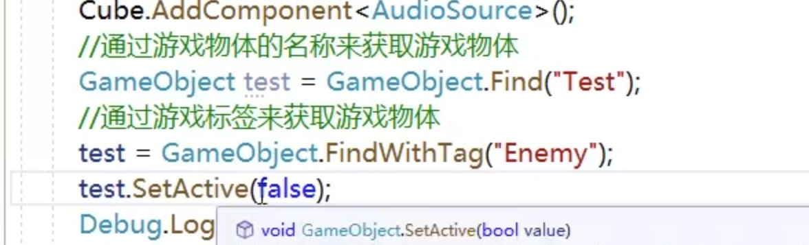
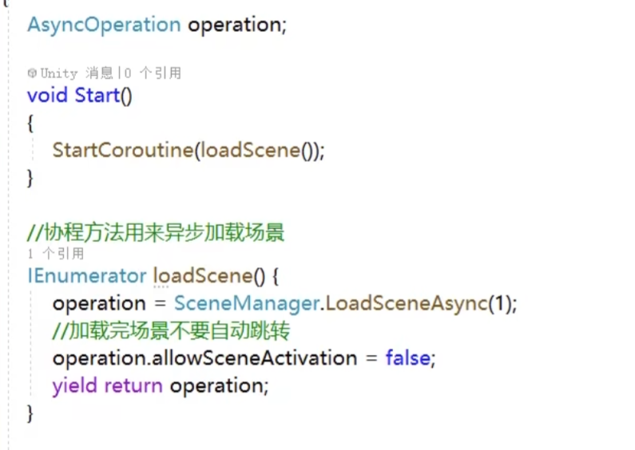
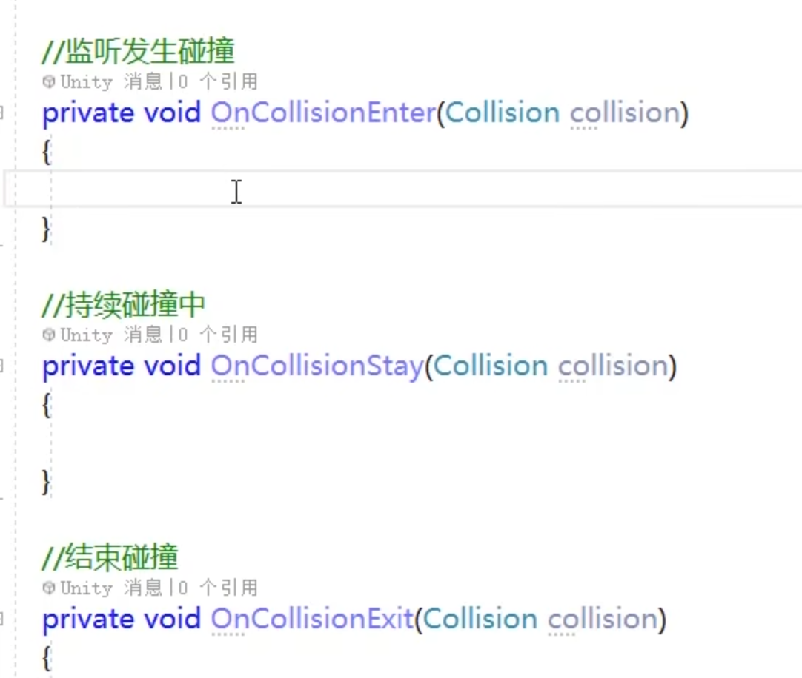

# Unity

Unity内常见单词

render： 成为

miscellaneous： 混杂的

physical： 身体、物理

navigation： 导航

mesh：网状


cube：立方体

collider：碰撞

rendering：渲染


## 地形

地形工具

Raise or Lower Terrain 

## 材质

给物体添加颜色和表面等







游戏中父子组件的关系维持依赖于 Transform            


position：获取当前世界位置

LocalPosition：获取当前位置


## 键盘操作

key 按下那一刻到松开为止

keyDown 只会在按下那一刻触发

keyUp 离开的那一刻触发

键盘鼠标操作写在Update（每一帧）方法里面


虚拟轴


## 获取鼠标输入

```
// 获取鼠标输入
        float mouseX = Input.GetAxis("Mouse X") * mouseSensitivity * Time.deltaTime;
        float mouseY = Input.GetAxis("Mouse Y") * mouseSensitivity * Time.deltaTime;
```

灯光烘焙

音效


character controller 角色控制组件


## 重力

需要重力的物体加上Regidbody 组件

都需要加上Collider碰撞组件




Spring Joint 弹簧，连接

Hinge Joint

Fixed Joint 固定关节


冰面材质

创建一个物理材质

红外线


粒子系统

画线

Line Renderer

拖尾

Trail Renderer

## 动画组件


 Animator 新版 

1.新建动画控制器 Animator Controller

2.把动画放到动画控制器中

3.需要动画的物体加上 Animator组件


关闭有退出时间，不再等待上一个动画执行完


路径导航


## 碰撞器 

后缀为 Colider的组件，

如果勾上触发器(IsTrigger)，那么该组件视为触发器，不再提供碰撞

OnTriggerEnter 进入触发器时触发一次

OnTriggerStay 停留在触发器内时触发

OnTriggerExit 离开触发器时触发

方法内的 Collider onther 是触发的对象

## UI

Vertical Layout Group 垂直布局

## 导航

需要添加 Nav Mesh Agnet 组件 ，给地面设置成为 navigation static

## 操作记录

武器，在握住的地方加上一个空对象使其重合，然后将武器添加到空对象子中，然后对这个空对象进行操作.

动画中如果需要持续触发，比如奔跑就设置为trigger。

坑

在导入自己的图片的时候，如果想使用，需要把TextTure Type类型改为Sprite。

向量相减，比如 a - b，那么就得到 指向 a 的向量，这时调用Normalize，得到单位向量（为什么要算出单位向量而不是使用原向量，如果使用原向量，那么两个物体距离越远，值会越大，那么移动速度就会很快，的到单位向量，在不改变方向的情况下使得物体匀速运动）

Vector3.Lerp方法，第一个参数：开始位置，第二个参数：目标位置，第三个参数：速度

Instantiate方法，第一个参数：初始化的对象，第二个参数：生成位置，第三个参数：旋转的方向

解决射击动作和移动问题


 水制作
