## 私钥

私钥是随机生成的 256 位的大数字，原始的私钥通常以 16 进制格式显示，它用作创建公钥的源。

如何创建私钥？

要创建私钥，只需要生成一个随机的 256 位数字，生成私钥的关键部分是使用可靠的随机数来源，如果使用的是 Linux，则可靠的随机数来源是 /dev/urandom

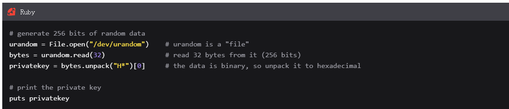

也可以使用 SHA-256 哈希函数对一些随机的数据进行哈希处理，得到的结果可用作私钥。注意：你哈希的数据必须适当大并且随机。

私钥范围

有效的私钥秘钥是介于以下数字范围（包含）之间的任意数字

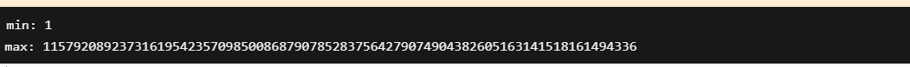

最大值为 n-1，其中 n 是比特币中使用的椭圆曲线上的点数（secp256k1）。这略小于 256 位数字的最大值。

因此，如果要生成一个随机的 256 位（32 字节）数字，则需要在使用前检查它是否高于最大值。

注意！！！

编程语言中默认的随机数函数通常不够安全，无法生成私钥，大多数语言中的标准 rand() 函数只是生成随机数字的快速简便方式，但它们的随机性不足以用于加密目的，例如生成私钥。

有时生成随机字节更容易。所以可以只生成 32 个随机字节并将其用作你的私钥，因为这相当于生成一个 256 位的数字。

比特币如何使用私钥？

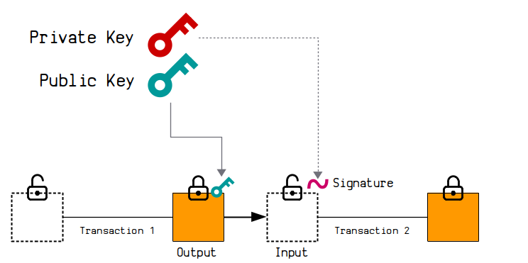

私钥是计算公钥的起点，私钥也可用于签名，这些签名与公钥有数学联系。

## 公钥

公钥是根据私钥计算得出的，两种之间存在数学联系。

如何创建公钥？

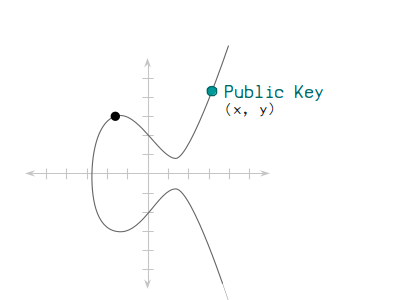

公钥是通过椭圆曲线乘法创建的，你将 secp256k1 椭圆曲线上的起点乘以私钥，这将产生一组 x 和 y 坐标，即公钥，所以公钥只是椭圆曲线上一个点。

比特币中如何使用公钥？

当你想要接受比特币时，需要使用到公钥，有人在交易中向你发送比特币时，会将你的公钥放在其中一个输出顶部的锁中，并且只能通过使用私钥创建证明你是公钥所有者的签名来解锁它。

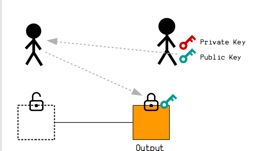

## 椭圆曲线

一条椭圆曲线由满足下列形式的等式的所有点构成：

y2=x3+ax+b

同时 4a3+27b2≠04a3+27b2≠0 （这是为了避免奇点（[singular points](http://mathworld.wolfram.com/SingularPoint.html)））。

下面是一些椭圆曲线的例子：

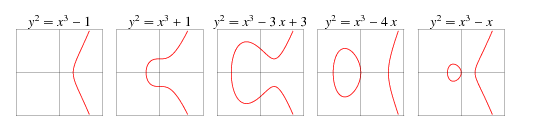

注意，上面所有的椭圆曲线都是 X 轴对称的。实际上，所有的椭圆曲线都如此，这是其形式所决定的。

y2=x3+ax+by2=x3+ax+b

如果你取等式两边的平方根，就可以得到：

y=±x3+ax+b−−−−−−−−−√y=±x3+ax+b

所以，如果取 a 为 27 而 b 为 2， 那么插入 x = 2 时，可得 y = ±8，也就是两个点 （2, -8）和（2, 8）。

下面这个椭圆曲线是比特币、以太坊等项目使用的椭圆曲线，叫做 “secp256k1”。这条曲线的等式是 y2=x3+7y2=x3+7，图像是：

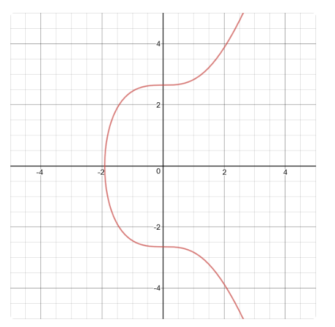

### 点加法

你肯定知道如何把两个数相加，得出第三个数吧？在椭圆曲线上，你可以把两个点相加，得出第三个点。

要在一条椭圆曲线上把两个点相加，你先要找出一条穿过这两个点的直线。然后，这条直线与椭圆曲线的交点就是第三个点，最后，这个点跟 x 轴的对称点（也即其 y 坐标值乘以 -1 ）即是两个点相加的结果。

我们来举个例子，假设我们要把下图所示的两个点相加：

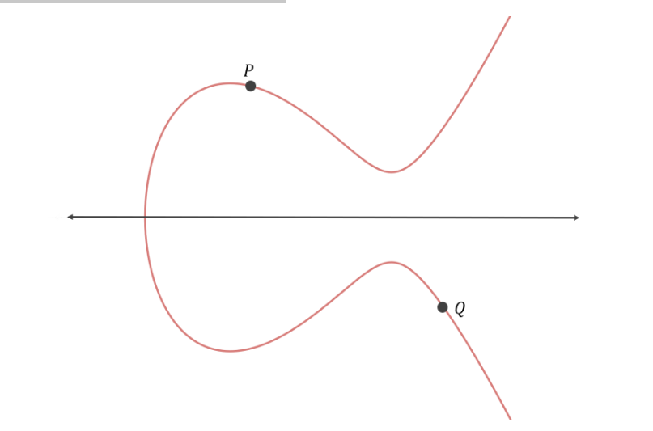

首先，作出一条穿过这两个点的直线：

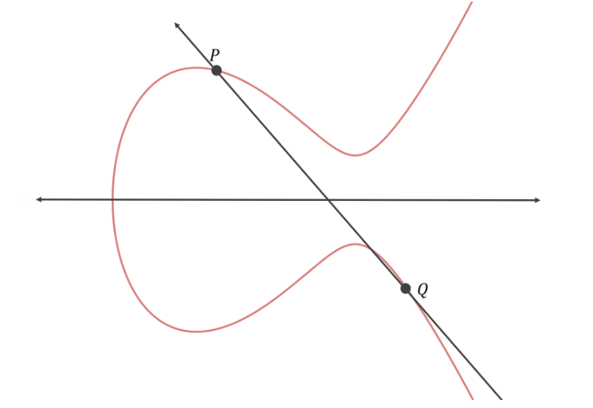

然后找出这条直线与椭圆曲线相交的点（第三个点）：

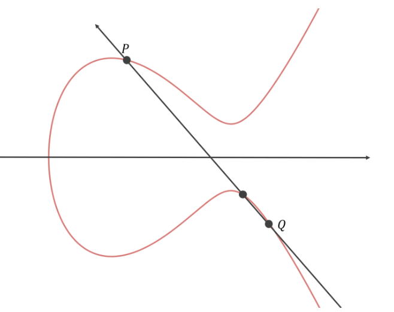

最后，找出与该点 x 轴对称的点：

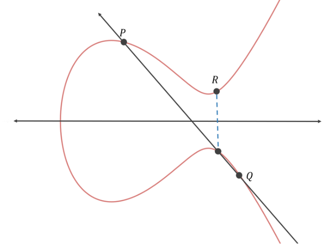

所以，P + Q = R。

为了方便实现椭圆曲线密码学，我们不是把两个点相加，而是在曲线上定义一个基本点，总是让这个点与自身相加。

举个例子，假设我们在下列曲线上有基本点 P：

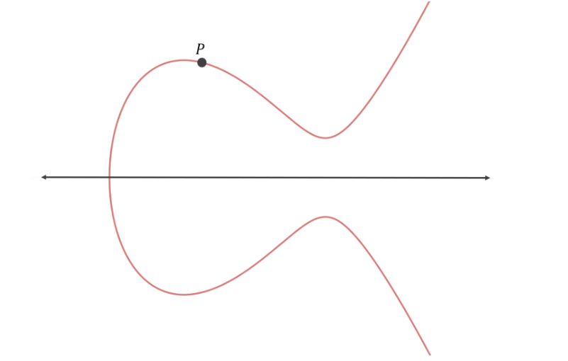

自然，我们就有了 P，或者说 1·P。

现在，我们让 P 与自身相加。首先，我们找出一个过 P 和 P 的直线（及其等式）。这样的直线有无数条！所以，在这种特殊的情形中，我们选择 P 点上椭圆曲线的切线：

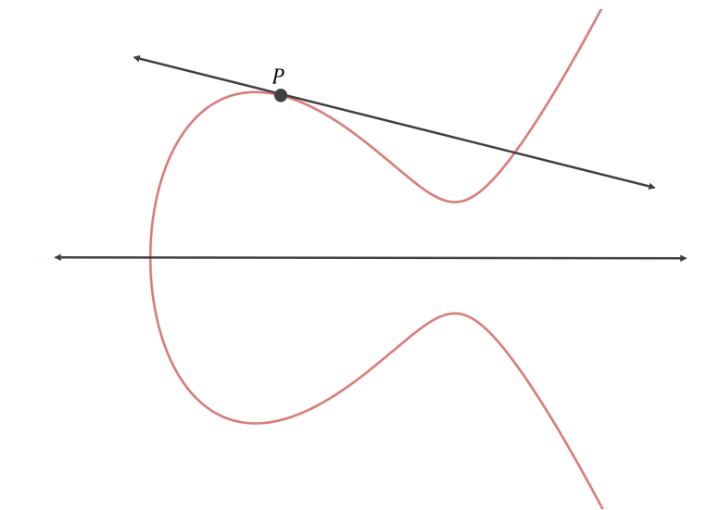

现在，我们可以找出 “第三点” 并通过 x 轴对称找到结果：

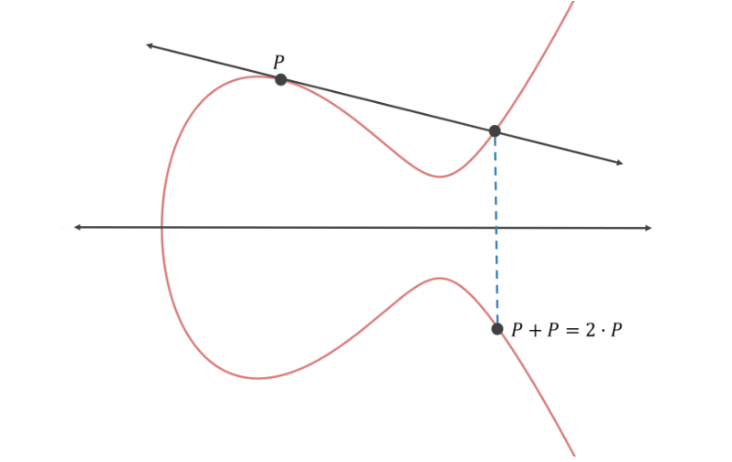

这就是 P 与自身相加的结果，P + P 或者说 2·P。

如果我们使之再与 P 相加，那是让 P 加上自身再加上自身，结果就是 3·P。为了计算 3·P，我们直接让两点相加即可：

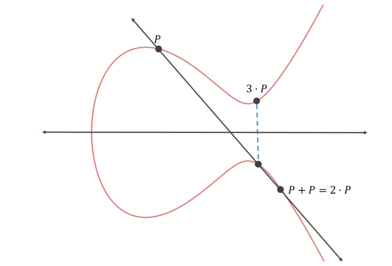

我们可以继续加下去，得出 4·P、5·P，等等。

secp256k1 所用的基本点的 x 坐标值和 y 坐标值为：

x 坐标值：55066263022277343669578718895168534326250603453777594175500187360389116729240

y 坐标值：32670510020758816978083085130507043184471273380659243275938904335757337482424

### 快速点加法

如果你要计算 10·P，需要多少步呢？直觉来看，需要 9 步，因为 10·P 等于：

P + P + P + P + P + P + P + P + P + P

需要 9 次点加法。

但事实证明，你只需 4 步就可以计算 10·P，因为点加法满足下列属性：

n•P + r•P = (n + r)•P

举个例子：

4•P + 6•P = (4 + 6)•P = 10•P

那么，你可以这样计算 10·P：

P + P = 2•P

2•P + 2•P = 4•P

4•P + 4•P = 8•P

2•P + 8•P=10•P

这就只需要 4 次点加法。

那么，计算 x·P 需要多少步呢？x 是一个随机的 256 位整数，在我们这个例子中，x 的取值范围是从 0 到 1.1579209e+77。

事实又证明，你计算 x·P 最多只需要 510 次的点加法运算。解释一下：首先，你计算下列值：

2⁰•P、2¹•P、2²•P、2³•P、2⁴•P、2⁵•P、2⁶•P、…、2²⁵⁵•P

你可以用 255 次点加法计算出上面的所有值，因为这里有 256 个点，而你只要将前一个点与自身相加就可以得到后一个点。这是因为 2n∙P+2n∙P=2n+1∙P2n•P+2n•P=2n+1•P。

下一步就是找出 x 的二进制表示。举个例子，如果 x 是 246，那么其二进制展开就是 2⁷ + 2⁶ + 2⁵ + 2⁴ +2² + 2¹ = 246 。那么，我们就可以使用其二进制展开式来计算 246·P 的结果：2⁷•P + 2⁶•P + 2⁵•P + 2⁴•P + 2²•P + 2¹•P。我们不再需要一个一个点计算，因为这些点我们都提前算好了。

因为 x 的二进制展开式最多包含 256 个元素（从 2⁰ 到 2²⁵⁵），所以我们最多只需要把 256 个点相加，因此，最多只需要 255 次点加法。因此，总的来说，计算 x·P 最多只需要 510 次点加法。

### 椭圆曲线密码学中的私钥和公钥

假设我们要计算 x·P，而 x 是一个 256 位的随机整数。结果将是椭圆曲线上的一个点，我们称为点 X。

如果我给你 X，你能计算出 x 来吗？换句话来说，你能确定我相加了几次 P 来得到 X 吗？假设你是知道 P，也知道我使用的是哪条曲线。

事实证明，即使你拥有一台超级计算机，计算出 x 也是不可行的。没有已知的算法能计算出 x，所以你的唯一解法便是不断把 P 与自身相加，直至获得 X，或者从 X 中持续减去 P，直到结果就是 P。 x 是 0 到 2²⁵⁶-1 之间的某个数，所以其平均值为 2¹²⁸；因此，你需要做平均 2¹²⁸ 次点加法来求得 x。即使你的计算机可以每秒做 10000 亿次点加法，你从宇宙初创的那一刻开始跑计算机，到今天你也只能完成 2⁹⁸ 次点加法。而 2⁹⁸/2¹²⁸ =1/1073741824。

从正中间开始会不会快一点呢？比如，不到 510 步就能先算出 2¹²⁸•P。嗯，因为平均而言，x 接近 2¹²⁸ 的概率并不比它接近 0 或者 2²⁵⁶-1 的概率更大，它是随机分布的，所以你从哪里开始，结果都是一样的。平均而言你还是必须做 2¹²⁸ 次点加法。

### 私钥和公钥

所以，因为别人无法根据给定的 X 求得 x（X = x·P），所以 x 很适合用作你的私钥，而 X 就是你的公钥。因此，你的私钥是一个 256 位的随机整数，而公钥则是椭圆曲线上的点的 x 坐标值和 y 坐标值。这就满足了私钥和公钥所需的属性：

“从给定的公钥中推导出对应的私钥在计算上是不可行的”。

你可以无需揭示任何关于 x 的有用信息，就向别人证明你知道 x。也就是说，你可以向别人证明，你知道 P 与自身相加多少次可以得到 X，而无需告诉他们 x 到底是多少。

### 更新的椭圆曲线模型

在我们向其他人证明自己知道 x 之前，我们需要更新我们的椭圆曲线模型。

我们当前的模型的一个问题在于，x·P 的结果的 x 坐标值和 y 坐标值可能过大，无法存储在一个标准的 512 位的公钥中。x 坐标值和 y 坐标值都有可能过大。

接近方案是将我们的椭圆曲线定义在一个有限域上。基本上，就是确保只有椭圆曲线上只有整数点，而且这个点的坐标值是有上限的。

为达成这个目标，我们将等式

y2=x3+ax+by2=x3+ax+b

转化成：

公式

y2 mod p = (x3 + ax + b) mod p

p 是某个指数（p 必须是质数，以保证加法和乘法总是能被还原（can always be undone））。

在 secp256k1 中， p 是小于 2²⁵⁶ 的最大质数。

我们的椭圆曲线因此看起来就像这样：

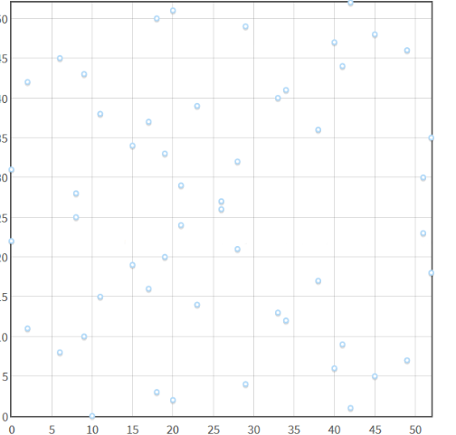

注意，这里依然有一条水平的对称线。

那么，现在你想把两个点相加，穿过这两个点的直线在跟第三个点相交之前就会飞到值域之外，那怎么办呢？让线从另一边开始继续延伸！

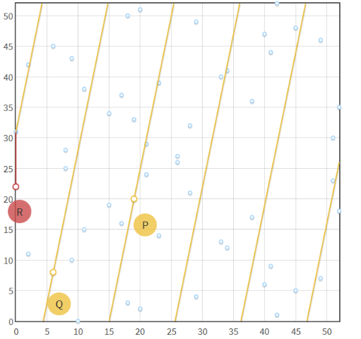

如上图所示，你会发现，把 P 跟 Q 相加需要让 P 跟 Q 之间的线来回环绕多次。

### 如何证明你知道 x

现在，你算出了 X = x·P，而 x 是一个 256 位的整数，你如何证明你知道对应于 X 的 x，且无需暴露关于 x 的任何有用信息呢？

你可以使用我们前面提到的点加法的属性：

n•P + r•P = (n + r)•P

稍微修改一下，可得：

hash(m, r•P)•n•P + r•P = (hash(m, r•P)*n + r)•P

你把方程的右半部分展开，就可以得到左边的部分，所以它对任意的 m、r 和 n，都是成立的。

那，不如我们令 n·P = X？这样就有：

hash(m, r•P)•X + r•P = (hash(m, r•P)*n + r)•P

如果 n·P = X，那 n 就等于 x，再转写一下，就是：

hash(m, r•P)•X + r•P = (hash(m, r•P)*x + r)•P

最后，我们做一下代换，令 R = r·P、 s = hash(m, R) * x + r 。

于是：

hash(m, R)•X + R = s•P

那么，我们再来回顾这个命题：如果你能提供一组 m、R 和 s，满足上述方程，那就能证明你知道对应于 X 的 x，即 x·P = X 。

要使该命题为真，需要满足两个前提：

1. 只要你知道 x，那你就能提供合适的 m、R 和 s 值来满足上述方程
2. 如果你不知道 x，那么你不可能找出满足上述方程的 m、R 和 s

如果你知道 x，显然你可以找出可以满足上述方程的值。选择随机的 m 和 r，然后计算 R = r·P，然后 s = hash(m, R) * x + r，代入方程 hash(m, R)•X + R = s•P，可得：

hash(m, r•P)•n•P + r•P = (hash(m, r•P)*n + r)•P

正是我们前面说的，对任意 m、r 和 n（在我们这里就是 x）都成立的等式。

那要是你不知道 x 呢？你可以计算出能满足上述方程的 m、R 和 s 吗？问题就在于，你要解出 hash(m,R)•X + R = s•P。基本上，你这是要找出一个哈希值的原像，而这是不可能的，至少在计算上是不可行的，因为密码学哈希函数有[原像攻击抗性](https://en.wikipedia.org/wiki/Preimage_attack)。

因此，唯一能够提供有效的 m、R 和 s 值的方法就是使用 x 来计算它们。因此，你可以通过提供满足等式 hash(m, R)•X + R = s•P 的 m、R 和 s 值来证明你知道 x。

### 在这个过程中，你真的没有暴露关于 x 的信息吗？

如果你已经提供了有效的 m、R 和 s，别人能从中知道关于 x 的有效信息吗？

m 和 R 都跟 x 无关，所以这些值不会暴露关于 x 的有效信息。

而我们知道，s = hash(m, R) * x + r 。能不能从 s 中计算出 x 呢？

这就是在讨论，我们能否解出 x = (s-r)/hash(m, R) 。

因为我们不知道 r，所以无法从 s 中计算出 x。而我们也无法从 R = r·P 中计算出 r，因为这就是想知道 P 与自己相加多少次能得到 R，也就是想从 X 中知道 x，在计算上是不可能的。

s 也不会暴露关于 x 的信息（比如 “x 必然小于 bala bala”）。如果 r 是随机生成的，而我们允许 hash(m, R) * x + r 溢出使得 r 可以是任何 256 位的整数，那么 s 的值就是完全随机的，s 可以是任何 256 位的整数。一个随机的 256 位整数，所蕴含的有关 x 的信息，恐怕就跟新西兰的 GDP 所蕴含的一样多。

### 数字签名

m、R 和 s 可以用来证明某人知道相应于 X 的 x（X = x·P）。验证这个证据需要把 m、R 和 s 代入等式 hash(m,R)•X + R = s•P。那么，我们是否能然验证依赖于一条特定的消息，使得这个证据 —— m、R 和 s —— 变成对该消息的一个数字签名？当然可以！

假设 m 就是那条消息，而 R 和 s 就是这条消息的数字签名。验证将仅在这条消息，也即是 m，代入验证等式之时，才会成功。如果代入的是另一条消息，则左右两边将不相等，因为计算 s 所用的 m 值与代入得消息不等。

因此，你可以通过提供一个数字签名 R 和 s，以及相应的消息 m，来证明你知道相应于公钥 X 的私钥 x。

在密码学货币中，这个消息就是一笔交易的待签名的部分。一条交易的数字签名，通常是 R 的 x 坐标值后面跟着 s（R 是椭圆曲线上的一个点，s 是近乎随机的 256 位整数），然后还要编码成十六进制的形式。

### 结论

如果你想获得一个比特币地址或者以太坊账户，你只需生成一个随机的 256 位整数 x，x 就是你的私钥。然后你使用 secp256k1 的参数就可以计算出公钥 X = x·P。你的公钥可以放心地展示给别人，无法用来反算出你的私钥。再对公钥哈希计算，就得到了地址。

当你想把自己地址里的比特币发给其他人时，你要创建一笔比特币交易。把交易的待签名部分设置成 m，并使用该 m 计算出 R 和 s。然后在交易中附加上 R 和 s。在你把这笔交易广播到比特币网络中以后，收到交易的节点会验证 m（交易的待签名部分）、R 和 s 满足等式 hash(m,R)•X + R = s•P。当然，这也假设了你要在交易中提供 X，因为你的公钥无法从地址中推测出来。在以太坊交易中，你无需提供 X，可以提供 v，v 可用来从 R 和 s 中计算出 X。

