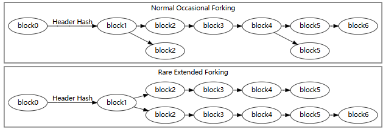

## 简介

比特币网络中的每个完整节点独立存储一个区块链，其中仅包含由该节点验证的区块。当多个节点的区块链中都有相同的区块时，它们被认为是共识的。这些节点为维持共识而遵循的验证规则称为共识规则。

上图是一个区块链的简化版本，一个或多个新交易的区块被收集到区块的 transaction data 部分。每笔交易的副本都经过哈希处理，然后对哈希值进行配对、哈希处理、再次配对和在此哈希处理，直到只剩下一个哈希值，即默克尔树的默克尔根。

merkle 根存储在区块头中。每个区块还存储前一个区块标头的哈希值，并将区块链接在一起。这确保了如果不修改记录交易的区块和所有后续区块，就无法修改交易。

## 交易

交易被链接在一起。比特币钱包软件给人的印象是聪（比特币中最小的交易单位）是从钱包发送和发送到钱包的，但比特币实际上是从一个交易转移到另一个交易。每笔交易都会花费之前在一个或多个早期交易中收到的聪，因此一笔交易的输入是前一笔交易的输出。

单个交易可以创建多个输出，就像发送到多个地址时的情况一样，但特定交易的每个输出只能在区块链中用作一次输入。任何后续的引用都是被禁止的

由于特定交易的每个输出只能花费一次，因此区块链中包含的所有交易的输出都可以归类为未花费的交易输出（UTXO）或已花费的交易输出。要使付款有效，它必须仅使用 UTXO 作为输入。

忽略 coinbase 交易，如果交易输出的价值超过其输入，该交易将被拒绝——但如果输入超过输出的价值，则创建包含该交易的区块的比特币矿工可能会要求任何价值差异作为交易费用。例如，在上图中，每笔交易花费的比从其总输入中获得的少 10,000 聪，实际上支付了 10,000 聪的交易费用。

在交易输出中，每个输出都会有有一个锁，如果在未解锁这些输出的情况下创建交易，比特币网络上的节点将拒绝该交易。

coinbase 交易

指的是区块链中的第一笔特殊交易，也称为挖矿奖励交易，这是一种特殊类型的事务，只有一个空白 input ，换句话说，coinbase 交易的输出是新比特币的来源。

何时可以进行 coinbase 交易 ？

coinbase 交易的输出只有交易在区块链中深入100个区块后才能使用，因为如果矿工立即花掉了它们的 coinbase 交易产出，并且发生了链重组（后面描述），这意味着包含该 coinbase 交易的区块从区块链中删除，那么该交易及其所有的后代都将失效。

所有这些子交易*都依赖于*单个 coinbase 交易，如果该 coinbase 交易被移出区块链，则*完全相同*的 coinbase 交易稍后无法重新进入区块链（因为它包高度，更改高度会更改其 TXID）。因此，所有这些子事务都将永久无效。

因此，通过等待 100 个区块，可以确信 coinbase 交易是一成不变的，因此几乎不可能在 coinbase 交易深入 100 个区块后从区块链中删除（链重组通常只有 1 或 2 个区块深）。

## 区块链

### 区块奖励减半（Block Subsidy Halving）

区块奖励每210,000个区块后减半（大约每4年一次）

区块补贴的减半创造了比特币的固定供应量，因为最终补贴将达到零，并且不会发行新的比特币。

例如，区块补贴从 50 BTC 开始。然后在区块高度 210,000 时，它减半到 25 BTC，在区块高度 420,000 时，它减半到 12.5 BTC，依此类推。在区块高度 6,930,000 时（总共减半 33 次），补贴将达到零。

### 工作量证明（Proof Of Work）

区块链由网络上的匿名对等节点协作维护，因此比特币要求每个区块证明在其创建过程中投入了大量工作，以确保想要修改过去区块的不可信对等节点必须比只想向区块链添加新区块的诚实对等节点更加努力。

区块链接在一起使得在不修改所有后续区块的情况下无法修改任何区块中包含的交易。因此，修改特定区块的成本随着添加到区块链中的每个新区块而增加，从而放大了工作量证明的效果。

只有当新区块的哈希值至少与共识协议预期的难度值一样具有挑战性时，新区块才会被添加到区块链中。每 2,016 个区块，网络使用存储在每个区块头中的时间戳来计算最后 2,016 个区块中第一个和最后一个区块生成之间经过的秒数。理想值为 1,209,600 秒（两周）。

- 如果生成 2,016 个区块的时间不到两周，则预期难度值会按比例增加（高达 300%），因此，如果以相同的速率检查哈希值，则接下来的 2,016 个区块应该需要整整两周的时间才能生成。
- 如果生成区块的时间超过两周，则出于同样的原因，预期的难度值会按比例降低（高达 75%）。

### 区块高度和分叉 （Block Height And Forking）

任何成功将区块头哈希为低于目标阈值的值的比特币矿工都可以将整个区块添加到区块链中，这些区块通常由它们的区块高度来表示，即它们与第一个比特币块（区块 0，通常称为创世区块）之前的区块数量，例如，区块 2016 是可以首先调整难度的地方。

​                                                                                                                     常见和不常见的区块链分叉

多个区块可以具有相同的区块高度，当两个或多个矿工各自在大致相同的时间产生一个区块时，这种情况很常见。这会在区块链中创建一个明显的分叉，如上图所示。

当矿工在区块链的末端同时产生区块时，每个节点单独选择要接受的区块。在没有其他考虑的情况下，节点通常使用它们看到的第一个块。

最终，矿工产生另一个区块，该区块仅连接到一个同时竞争的区块上。这使得前叉的那一侧比另一侧更坚固。假设一个分叉只包含有效的区块，普通的 Peer 节点总是遵循最难的链来重新创建并丢弃属于较短分叉的陈旧区块。（陈旧块有时也称为 orphan 或 orphan 块）

如果不同的矿工出于交叉目的工作，则有可能发生长期分叉，例如一些矿工努力扩展区块链，同时其他矿工正在尝试 51% 攻击以修改交易历史。

### 共识规则变更（Consensus Rule Changes）

为了维持共识，所有全节点都使用相同的共识规则验证区块。但是，有时共识规则会发生变化，以引入新功能或防止网络滥用。当新规则实施时，可能会有一段时间未升级的节点遵循旧规则，而升级后的节点遵循新规则，从而产生两种可能打破共识的方式：

- 遵循新共识规则的区块被升级后的节点接受，但被未升级的节点拒绝。例如，在区块中使用了新的交易功能：升级后的节点理解该功能并接受它，但未升级的节点拒绝它，因为它违反了旧规则。
- 违反新共识规则的区块被升级后的节点拒绝，但被未升级的节点接受。例如，区块内使用了滥用交易功能：升级后的节点拒绝它，因为它违反了新规则，但未升级的节点接受它，因为它遵循旧规则。

在第一种情况下，未升级节点拒绝，从这些未升级节点获取区块链数据的挖矿软件拒绝与从升级节点获取数据的挖矿软件在同一条链上构建。这会创建永久不同的链（一个用于未升级的节点，一个用于已升级的节点），称为硬分叉。

例如在2017年从 BTC 硬分叉创建 BTH ，BTH 解决 BTC 中交易费用高，交易时间缓慢的问题，旨在实现一个点对点的电子现金系统，促进日常交易和小额支付。

在第二种情况下，被升级后的节点拒绝，如果升级后的节点控制了大部分哈希率，则可以防止区块链永久分叉。这是因为，在这种情况下，未升级的节点将接受所有与升级节点相同的区块为有效区块，因此升级后的节点可以构建更强大的链，未升级的节点将接受该链为最佳有效区块链。这称为软分叉

### 链重组（Chain Reorganization）

链重组通常发生在同时开采两个区块之后，由于区块在网络上的传播速度，一些节点会先收到一个区块，一些节点会先收到另一个区块，因此，对于这些区块中哪个区块实际上是 “第一个” 并且属于每个人的区块链顶部，将存在暂时的分歧。

那么，我们如何解决这一争议并确保每个人都同意相同版本的区块链呢？

当下一个区块被开采时，它就解决了。下一个要开采的区块将建立*在其中一个区块*之上，创建一个新的最长链。当节点收到这个最新的区块时，他们会看到它创建了一个新的最长链，并且他们将执行*链重组*以采用它。

因此，由于链重组，每个节点最终都同意与其他人相同的区块链版本。

旧的最长链中的交易会怎么样？

如果某个区块因链重组（“过时区块”）而被停用，则其中的交易不再是区块链的一部分 。

所以，如果你要尝试在过时的区块中花费交易的输出，节点会拒绝你的交易。

实际上，如果同时开采两个区块，它们可能会包含相同（或类似）的交易，因此重组通常不会引起问题。

但是，如果陈旧区块中存在*不在*竞争区块中的交易，它们将被发送回您节点的内存池中，并再次在网络中传播，以便*有机会*被挖掘到未来的区块中。

## 地址

地址代表要防止在某些比特币上的特定类型的锁定脚本，它基本上是公钥哈希或脚本哈希的用户友好编码，所以，当您给某人一个地址时，您就是在要求他们使用地址中包含的公钥哈希或脚本哈希将您的比特币锁定到特定的脚本模式。

## 钱包

要开始使用比特币，第一件事就是创建自己的钱包，在创建钱包后，就可以开始接收和发送比特币

在创建钱包后，会在相应的目录下生成对应的种子文件，需要妥善保管好自己的种子文件，比特币资产都在这些文件中，可以将文件放到 U 盘中，这样就可以随处使用了。

钱包有什么功能？

比特币钱包管理你的发送和接收比特币所需要的密钥。

当发送比特币给其他人时，钱包将创建一个新交易，使用相应的私钥解锁你收到一定数量的比特币，并将一定数量的比特币锁定到其他人的地址上。

所以钱包主要做三件事：

1. 管理接收比特币所需的地址。
2. 管理发送比特币相应的私钥
3. 创建交易并将其发送到网络中

## 助记词

助记词是将随机生成的大数字表示为单词序列，这使得更容易记住，然后使用这些单词创建一个种子，用于在分层确定性钱包中生成拓展秘钥

生成助记词和种子有三个步骤

1. 生成熵
2. 熵到助记词
3. 助记词到种子

生成熵

熵应该是 128 到 256 位，并且应该是随机的，可以把熵看作是一个非常大的随机数，以前没有人生成过，未来也不会生成，我们生成的熵必须是 32 位的倍数，因为后面再转换为单词是将熵分成偶数块。

熵到助记词

首先，在熵中添加校验和以帮助检测错误（使最终句子更加友好），这个校验和是通过 SHA-256 对熵进行哈希处理来创建的，这为熵提供了一个独特的指纹，然后，每 32 位熵的开头取 1 位哈希值，并将其添加到熵的末尾。下面示例中，使用了 64 位熵，因此从熵的 SHA-256 开始取 2 位。

通过向每 32 位熵添加 1 位校验和，总是能够得到 33 位的倍数，因此我们可以将其拆分为相等的 11 位块。

接下来，将熵 + 校验和分成 11 位的组，将每组 11 位 转换为十进制，并使用这些数字作为索引从单词列表中选择相应的单词。

上面就是我们的助记词。

助记词到种子

要创建种子，需要通过 PBKDF2 函数输入助记词，PBKDF2 会多次散列助记词（+ 可选密码），直到产生最终的 64 字节的结果。

验证

助记词包含校验和，意味着可以检查给定的助记词是否有效，

1. 将助记词中的单词转换回位。
2. 确定熵部分和校验和部分。
3. 检查您从熵创建的校验和是否与给定的校验和匹配。

## 挖矿（Mining）

挖矿是在区块链上添加新的交易区块的过程。

首先，每个节点都将他们收到的最新交易存储在他们的内存池中，这只是他们计算机上的临时内存。然后，任何节点都可以尝试*将*交易从其内存池挖掘到共享文件（区块链）上。为此，节点将交易从其内存池中收集到一个称为区块的容器中，然后使用*处理能力*尝试将此交易区块添加到区块链上。

要将此区块添加到区块链中，必须将交易区块输入到称为哈希函数的东西中。哈希函数基本上是一个微型计算机程序，它将接收任意数量的数据，对其进行加扰，并吐出一个完全唯一（且不可预测）的数字。

为了使区块成功添加到区块链上，这个数字（或区块哈希）必须低于目标。

如果生成的区块哈希值不低于目标值，则可以对区块内的数据进行小幅调整，然后再次通过哈希函数进行处理。这将产生一个完全不同的数字，希望该数字低于目标。如果没有，可以调整块并重试。

最终，网络上的某个节点（或矿工）将在目标下方找到一个区块哈希，并且该交易区块将被添加到区块链中。

挖矿有两种形式：

- 单独挖矿，矿工尝试自己生成新区块，区块奖励和交易费用的收益完全归他自己所有，使他能够收到差异更大（付款间隔时间更长的）的大额付款
- 矿池挖矿，矿工与其他矿工汇集资源以更频繁地找到区块，收益在矿池矿工之间共享，与他们各自贡献的哈希算力大致相关，从而允许矿工以较小的方差（付款之间的时间更短）接收小额付款。

### 单独挖矿 （Solo Mining）

如下图所示，独立矿工通常使用 `bitcoind` 从网络获取新交易。他们的挖矿软件使用 “getblocktemplate”RPC 定期轮询 `bitcoind` 的新交易，RPC 提供新交易列表以及 coinbase 交易应发送到的公钥。

挖矿软件使用模板（如下所述）构建区块并创建区块头。然后，它将 80 字节的区块头连同目标阈值（难度设置）一起发送到其挖矿硬件 （ASIC）。挖矿硬件遍历区块头 nonce 的每个可能值，并生成相应的哈希值。

如果没有任何哈希值低于阈值，则挖矿硬件将从挖矿软件中获得带有新 merkle 根的更新区块头;这个新的区块头是通过向 Coinbase 交易的 Coinbase 字段添加额外的 nonce 数据来创建的。

另一方面，如果发现哈希值低于目标阈值，则挖矿硬件会将带有成功随机数的区块头返回给挖矿软件。挖矿软件将标头与区块相结合，并将完成的区块发送到 `bitcoind`，以广播到网络以添加到区块链中。

### 矿池挖矿（Pool Mining）

矿池矿工遵循类似的工作流程，如下图所示，它允许矿池运营商根据矿工完成的工作份额向矿工付款。矿池使用 `bitcoind` 从网络获取新交易。每个矿工的挖矿软件都连接到矿池并请求构建区块头所需的信息。

在矿池挖矿中，矿池将目标阈值设置为比网络难度高几个数量级（难度较低）的阈值。这会导致挖矿硬件返回许多区块头，这些区块头不会哈希到符合区块链条件的值，但会哈希值低于矿池的目标，证明（平均而言）矿工检查了一定比例的可能哈希值。

然后，矿工向矿池发送矿池所需的信息副本，以验证标头是否将在目标下方散列，以及标头 merkle 根字段引用的交易块是否对矿池的用途有效。

矿工发送到矿池的信息称为份额，因为它证明矿工完成了一部分工作。矿池收到的一些份额也会低于网络目标，矿池将这些份额发送到网络添加到区块链中。

开采该区块所得的区块奖励和交易费用将支付给矿池。矿池根据他们产生的份额数量将这些收益的一部分支付给个人矿工。例如，如果矿池的目标阈值比网络目标阈值低 100 倍，则平均需要生成 100 份才能创建一个成功的区块，因此矿池可以为收到的每份支付其支付的 1/100。不同的矿池基于这个基本的股份系统使用不同的奖励分配系统。

## 费用

费用就是交易的剩余部分，将你所有输入值相加并减去输出值，则剩余金额就是费用。

设置交易费用可以激励矿工将你的交易包含在他们的候选区块中，这是因为矿工可以通过 coinbase 交易从他们包含在区块中的交易中收取所有费用。

上面提到，矿工会从内存池中获取交易添加到新的区块中。

当内存池中的交易数量超过下一个区块的容量，矿工将选择用可用的最高费用交易来填充他们的候选区块。如果他们挖出区块，这最大限度地提高了他们能够领取的比特币数量。

所以，你的交易设置费用可以让你与其他交易竞争下一个区块中的空间。一般而言

- 费用越高，您的交易就会越早被开采。
- 费用越低，您的交易被开采所需的时间就越长。

如果内存池中的所有交易都可以进入下一个区块，您只需为您的交易设置最低费用，因为没有竞争进入下一个区块。

费率如何计算？

矿工希望最大限度地提高他们可以从区块中索取的费用金额。为了实现这一目标，他们根据每块区块占用的空间提供多少费用来衡量每笔交易。

例如，费用较高的小额交易比费用相同的大额交易更有价值。

因此，在比较交易费用时，我们将费用的大小除以交易的大小（就一个区块中占用多少空间而言）。这称为*费率* ，它允许我们比较交易，以找出哪些交易对矿工来说比其他交易更有价值。

- 费率越高，您的交易就会越早被开采。
- 费率越低，您的交易被开采所需的时间就越长